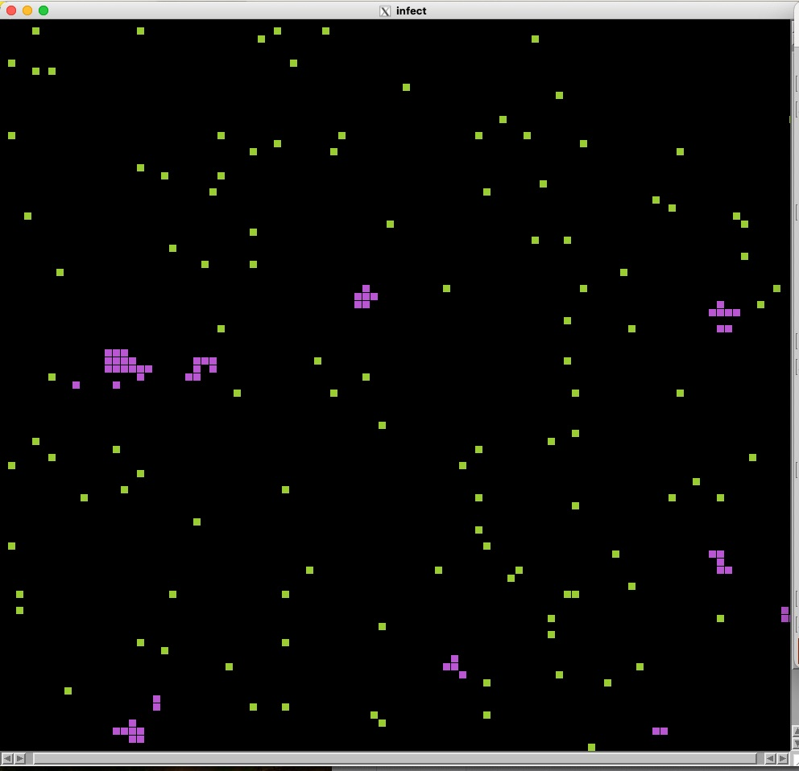

# Infectious cellular automaton

This code simulates the Infectious disease cellular automaton based on the RWCA model [1,2,3]. It uses [GSL](https://www.gnu.org/software/gsl/) for the random number generator and [EGGX](https://www.ir.isas.jaxa.jp/~cyamauch/eggx_procall/index.html) for graphics.

The updated rules are as follows.
- Each walker randomly walks around the 2D lattice following the RWCA rule.

- When a walker comes into contact with an infected walker, it then  gets infected and stays at the place. The health point of the walker becomes -n, say -100.

- The health point of the infected walker was added by one at each CA time step.  When the health point becomes -1, it becomes a healthy walker and start to walk around the system.

To compile the code, type 'make' in the program directory.

A snapshot of the system.

Time step evolutions of the number of infected walkers (purple) and healthy walkers (green).

[1] [Cellular automaton model for random walkers](https://journals.aps.org/prl/abstract/10.1103/PhysRevLett.77.1675)

[2] [Cellular automaton model for biased diffusive traffic flow](https://journals.jps.jp/doi/abs/10.1143/JPSJ.65.3415)

[3] [Probabilistic Cellular Automaton for Random Walkers](https://journals.jps.jp/doi/abs/10.1143/JPSJ.69.1352)
